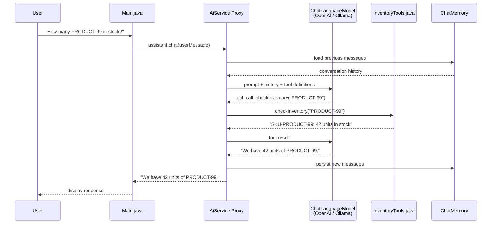
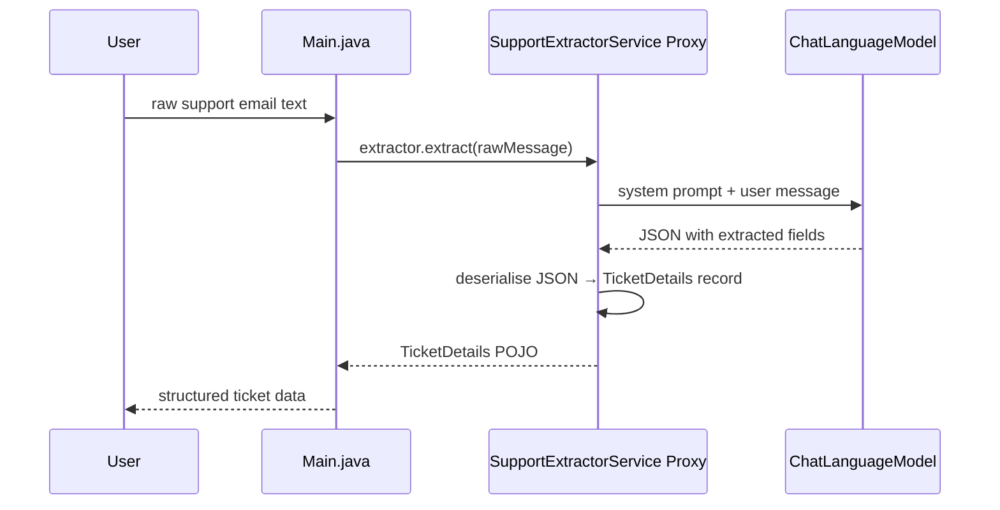
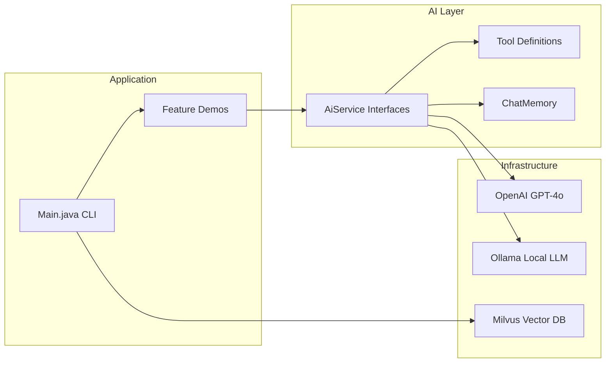

# Architecture: AI Service Orchestration

## Overview

LangChain4j's `AiServices` acts as a dynamic proxy that sits between application
code and the LLM provider. When a method on an AI Service interface is called:

1. The framework builds a prompt from the method signature, annotations, and arguments.
2. The prompt is sent to the configured LLM (OpenAI, Ollama, etc.).
3. If the model decides to invoke a **tool**, LangChain4j calls the corresponding
   Java method and feeds the result back into the model.
4. The final response is parsed into the declared return type (String, POJO, etc.).

## Sequence Diagram

## Structured Output Flow

## Component Overview

