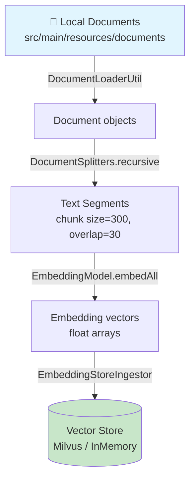
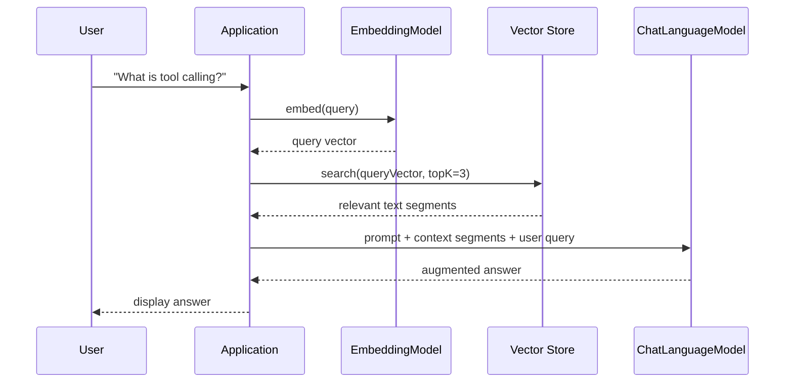
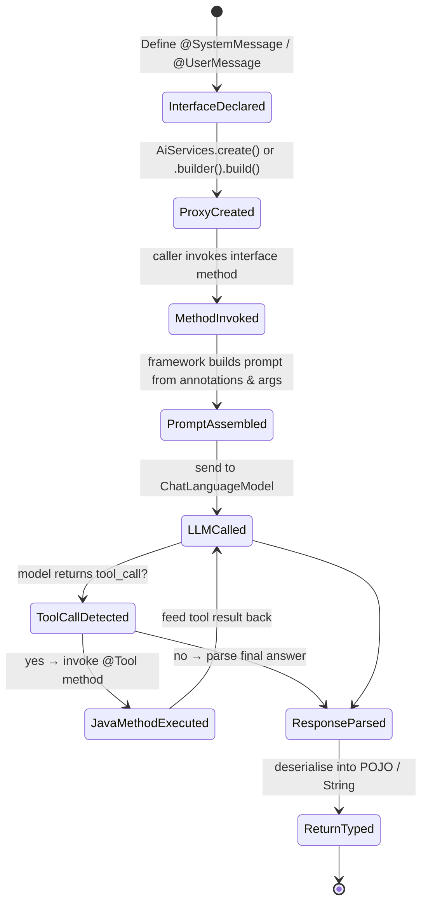

# RAG Pipeline: Document Ingestion

## Overview

The Retrieval-Augmented Generation (RAG) pipeline enriches LLM responses with
knowledge from local documents. The ingestion phase runs **offline** and
prepares the vector store before any user queries arrive.

### Pipeline stages

| Stage       | Component                | Description                                                |
|-------------|--------------------------|------------------------------------------------------------|
| **Load**    | `DocumentLoaderUtil`     | Reads `.txt` files from a local directory                  |
| **Split**   | `DocumentSplitters`      | Breaks documents into overlapping chunks (recursive split) |
| **Embed**   | `EmbeddingModel`         | Converts each chunk into a dense vector                    |
| **Store**   | `EmbeddingStoreIngestor` | Persists vectors + text in Milvus (or in-memory for dev)   |

## Ingestion Flowchart



## Retrieval Flow (Query-Time)



## Configuration

All tuning knobs live in `src/main/resources/application.properties`:

```properties
rag.chunk.size=300
rag.chunk.overlap=30
rag.documents.path=src/main/resources/documents
milvus.host=localhost
milvus.port=19530
milvus.collection.name=langchain4j_docs
```

## Deep Dive: AI Service Lifecycle


